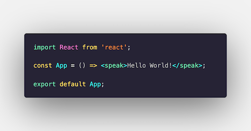

# Remix Voice

This is a demo app that uses [Remix](https://remix.run) and React to generate voice output.

## Motivation

Voice user interfaces (VUIs) have seen substantial growth in adaption and popularity over the past years. Much as web UIs, voice UIs have also grown in complexity over time. I built react-ssml-dom a few years back to utilize the power of composition and JSX to generate voice output. I wrote a small article about [my motivation](https://medium.com/@andre.timo.landgraf/a-react-renderer-for-ssml-91cdd1d66b3e) here.

I ran into a few issues though. Voice apps usually run on serverless functions and return JSON back to the client. That JSON usually includes a reply string in SSMl format. Unlike with the web, voice UIs do not allow an hydration on the client. There is no JavaScript being executed client-side in your Alexa device. Thus, we need to do all data fetching on the server, render our application, and return the finalized static markup to the client. So how do we fetch our data server-side in React? We could fetch the data in the server code outside of React and pass the data to the root React Component. Alternatively, we fetch the data inside our React Components (using useEffect server-side) and allowing our application to rerender a couple of times until one component resolves an app-wide promise that communicates to the server code that the app is ready to be sent to the client. That's what I ended up doing two years ago when I first hacked react-ssml-dom together. Unfortunately, that solution doesn't scale very well...

Today, we have Remix! Remix provides us with error and catch boundaries, loaders, actions, routing, and much more that we can all utilize in our voice application!

So let's try it and use Remix to render a React SSML application! 🤓

## Getting started

To start the app, run `npm run dev`, which fires up Remix.

Browsers actually know what SSML is (it's [built-in](https://developer.mozilla.org/en-US/docs/Web/API/SpeechSynthesis)!) but unfortunately, the browser won't read our document out loud. Instead it will attempt to download the file. That's not very useful! 

Instead, make your requests with curl or a similar tool. You can find a collection of valid requests in `index.http`

If you are using VS Code, check out [this plugin](https://marketplace.visualstudio.com/items?itemName=humao.rest-client), which allows you to run curl commands in VS Code.

`jsx
<speak>
Hello World!
</speak>
`

Cool! So how does it work?

## Step by Step Walkthrough

First we install react-ssml-dom: `npm i react-ssml-dom@latest`. ReactSSML is a custom renderer for React. It uses react-reconciler under the hood which allows you to very easily plug any host environment together with the React library.

We then alter the content of `entry.server.tsx`: 

- First, we replace `react-dom` with `react-ssml-dom`.
- We also change the content type of the response form `text/html` to `application/ssml+xml`.
- Similarly, we delete `<!DOCTYPE html>` and add `<?xml version="1.0"?>` instead.

Now our server will reply in proper SSML format! 🔥

In root.tsx, we change our HTML document to a SSML document. Since we won't hydrate on the browser, we also delete the `<Script />` call and all other JavaScript code that would otherwise be loaded into the head and body of our HTML. Likewise, we can delete the content of `entry.client.tsx` since we will never hydrate on the client!

Well, the rest is just React and Remix! We can create routes, catch and error boundaries, add loaders and actions, and access loader data inside our applications.

We created a server that can virtually be deployed anywhere and that is capable of returning SSML rendered by React! 🚀
